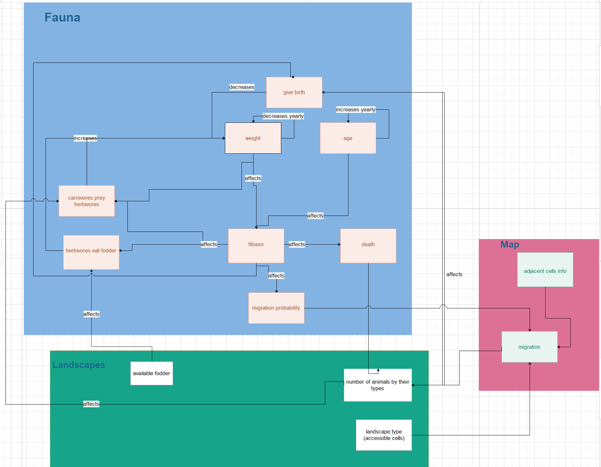

Implementation
====================
The BioSim model depends on *numpy*, *scipy* and *panda*. Also, for ploting *matplotlib* is used.

Model
-----
On the starting of the project, following model which shows the relations between attributes and variables in BioSim was drawn.

Classes
--------
This project consists of five python files. Each file contains classes and subclasses.

* **fauna.py**: contains *Fauna* abstract class and its subclasses, *Herbivore* and *Carnivore*.
* **landscapes.py**: consists of *Landscape* abstract class and its subclasses, *Savannah*, *Jungle*, *Desert*, *Mountain* and *Ocean*.
* **map.py**: has *Map* class.
* **simulation.py**: contains *BioSim* class.
* **visualisation.py**: has *Visualisation* class.

.. toctree::
   :maxdepth: 2
   :titlesonly:
   :caption: Contents:

   faunadoc
   landscapesdoc
   mapdoc
   simulationdoc
   visualisationdoc
